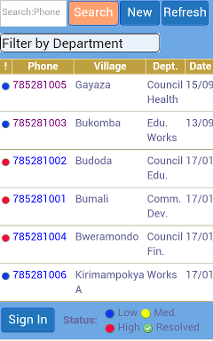



## Olutindo

<table>
  <tr>
    <td>
    Olutindo is a webapp for <a href="projects/2012/01/16/olutindo">managing citizen complaints in Uganda</a>. It is the html5 companion to the
    <a href='https://github.com/chrisekelley/olutindo-app'>Olutindo-app</a> Android application, which uses
    Phonegap/Cordova 3.x. Olutindo uses <a href='http://chrisekelley.github.io/coconut/'>Coconut</a> for most of its
    front-end form rendering, <a href='http://backbonejs.org'>backbone.js</a> for MVC, <a href='http://pouchdb.com/'>pouchdb</a>
    for browser-based data store and replication, and <a href='http://couchdb.apache.org/'>CouchDB</a> for the master data store.
    </td>
    <td>
    
    </td>
  </tr>
</table>

## AlloChrome

<table>
<tr>
<td>

</td>
<td>
<a href='https://github.com/chrisekelley/AlloChrome'>AlloChrome</a> is a test of
<a href='https://github.com/pwnall/chromeview'>ChromeView</a>, an embedded version of Chromium. The app tests how
well/if this embedded Chrome can render simple web pages using <a href='http://jonobr1.github.io/two.js/'>two.js</a>,
<a href='http://threejs.org/'>three.js</a>, and <a href='https://github.com/GoodBoyDigital/pixi.js'>pixi</a>.
</td>
</tr>
</table>

## voxel-label

Voxel-label is a [voxeljs module](http://voxeljs.com/#modules) that implements
[LabelPlugin](http://japhr.blogspot.com.es/2013/03/fun-with-threejs-camera-orientation.html), a three.js plugin that
adds labels to your game players (avatars). It can work in single-player mode as well as with
[voxel-client](https://github.com/maxogden/voxel-client) for labelling all avatars in a multiplayer game.

## voxel-app-server

[voxel-app-server](https://github.com/chrisekelley/voxel-app-server) is an extended implementation of
[voxel server](http://github.com/maxogden/voxel-server),
which is a multiplayer server for [voxel-engine](http://github.com/maxogden/voxel-engine).
voxel-app-server implements a voxeljs game using express (specifically express3), with user registration and authentication
via [everyauth](https://github.com/bnoguchi/everyauth/tree/express3).

## Andromeda

[Andromeda](https://github.com/chrisekelley/Andromeda) demonstrates how to manage the user registration and management
process using Syncpoint-Android. It is a demo of [TouchDB-Android](https://github.com/couchbaselabs/TouchDB-Android) and
[Syncpoint-Android](https://github.com/couchbaselabs/Syncpoint-Android) using <a href="http://incubator.apache.org/projects/callback.html">Apache Cordova (formerly PhoneGap)</a>, [Couchapp](http://couchapp.org), [TodoMVC](https://github.com/addyosmani/todomvc), and [ActionBarSherlock](http://actionbarsherlock.com/). It is an extension of [Android-TouchDB-Cordova](https://github.com/chrisekelley/Android-TouchDB-Cordova#android-couchbase-callback), which is a demonstration of the [TodoMVC backbone-require](https://github.com/addyosmani/todomvc/tree/master/dependency-examples/backbone_require)
app, which has been modified to work as a [Backbone boilerplate](https://github.com/tbranyen/backbone-boilerplate) project.
It is based upon [Android-Couchbase-Callback] (https://github.com/couchbaselabs/Android-Couchbase-Callback).

## Coconut

[Coconut](http://chrisekelley.github.io/coconut/) renders JSON defined forms in a browser and then saves the results to CouchDB.
Coconut uses CouchDB for data storage and synchronization, [Backbone.js](http://documentcloud.github.com/backbone) for MVC,
[backbone-couchdb](https://github.com/janmonschke/backbone-couchdb) to connect backbone to CouchDB, and
[D3](http://mbostock.github.com/d3/) for charts.

Coconut can be run on a computer or installed on a mobile phone or tablet.
[Android-Coconut-MobileFuton](https://github.com/vetula/Android-Coconut-MobileFuton) is an example that may be used on an Android 10.1" tablet.
[Android-Tims-MobileFuton](https://github.com/vetula/Android-Tims-MobileFuton) is formatted for Android smart phones.

[Olutindo](/projects/2012/01/16/olutindo/) is an Android app based on Coconut and deployed in Uganda.

## My Repositories and Other Work

- [Github](https://github.com/chrisekelley?tab=repositories)
- [Zcore](/projects/2011/05/02/zcore)

## Posts

<ul class="posts">
  
    <li>{{ post.date | date_to_string }} &raquo; <a href="{{ BASE_PATH }}{{ post.url }}">{{ post.title }}</a></li>
  
</ul>

